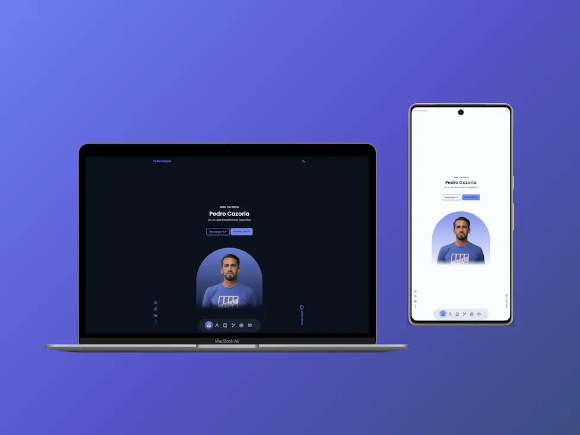

[](https://app.netlify.com/projects/portfolio-pedro-cazorla/deploys)

## 📸 Preview



---

# 🚀 Pedro Cazorla Portfolio

Professional portfolio of **Pedro Cazorla**, Bachelor in High Performance Sports.
Here you will find information about his experience, education, sports analysis, and featured videos.

---

## 🌟 Features

- **Responsive Design:** Adapts to all devices.
- **HTML, CSS & JavaScript:** Pure code, no frameworks.
- **Dark/Light Mode:** Switch themes with a single click.
- **Smooth Scroll:** Fluid navigation between sections.
- **Video Filtering:** View sports analysis by year.
- **Mobile First Optimization:** Designed for mobile from the start.

---

## 📂 Project Structure

```
├── assets/
│   ├── css/
│   ├── img/
│   ├── js/
├── index.html
├── README.md
```

---

## 🔗 Online Demo

Visit the live site on Netlify:
[portfolio-pedro-cazorla.netlify.app](https://portfolio-pedro-cazorla.netlify.app)

---

## 📬 Contact

Want to know more?
Contact Pedro Cazorla via [LinkedIn](https://www.linkedin.com/in/pedro-cazorla-786007183/) or [Instagram](https://www.instagram.com/pedro5cazorla).

